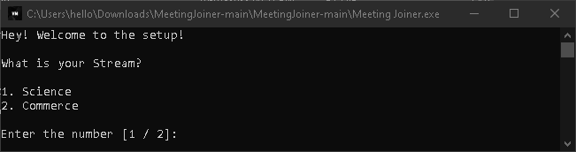

<div id="top"></div>

<!-- PROJECT LOGO -->
<br />
<div align="center">
  <a href="https://github.com/vineetmehtaa/MeetingJoiner">
    
  </a>

  <h3 align="center">Auto Meeting Joiner</h3>

  <p align="center">
    An awesome way to join all of your classes!
    <br />
    <br />
    <a href="https://github.com/vineetmehtaa/MeetingJoiner">View Demo</a>
    ·
    <a href="https://github.com/vineetmehtaa/MeetingJoiner/issues">Report Bug</a>
    ·
    <a href="https://github.com/vineetmehtaa/MeetingJoiner/issues">Request Feature</a>
  </p>
</div>

<!-- ABOUT THE PROJECT -->
## About The Project

<a href="https://github.com/vineetmehtaa/MeetingJoiner">
    
  </a>

You can always join your classes by finding the timetable and then looking for the link corresponding to it, but why not do it with just one click? You may say it's not possible but it's right here!

Here's why you should try this:
* You won't have the hassle of finding the links everytime before you join a class!
* You won't have to keep track of different links!
* It's one click-join :smile:

<p align="right">(<a href="#top">Back to top</a>)</p>

### Installation

_You can follow the steps given below to get your Meeting Joiner ready!_

_Method 1:_
1. Download the zip file by clicking on the green "Code" button ---> "Download ZIP".

<div align="left">
  <a href="https://github.com/vineetmehtaa/MeetingJoiner">
    
  </a>
</div>

  
2. Open file explorer and locate "MeetingJoiner-main.zip"
<div align="left">
  <a href="https://github.com/vineetmehtaa/MeetingJoiner">
    
  </a>
</div>
  
  
3. Right click on "MeetingJoiner-main.zip" and then click "Extract all"
<div align="left">
  <a href="https://github.com/vineetmehtaa/MeetingJoiner">
    
  </a>
  <a href="https://github.com/vineetmehtaa/MeetingJoiner">
    
  </a>
</div>
  
  
4. You will find the extracted folder!
<div align="left">
  <a href="https://github.com/vineetmehtaa/MeetingJoiner">
    
  </a>
</div>

  
5. Open the folder and find all the files
<div align="left">
  <a href="https://github.com/vineetmehtaa/MeetingJoiner">
    
  </a>
</div>

  
6. Run "Meeting Joiner", your antivirus might think this is a dangerous file to run. Click on "More info"
<div align="left">
  <a href="https://github.com/vineetmehtaa/MeetingJoiner">
    
  </a>

  
7. After clicking on "More info", click on "Run anyway"!
<div align="left">
  <a href="https://github.com/vineetmehtaa/MeetingJoiner">
    
  </a>
</div>
  
  
8. On your first run, the setup window for your details should open up as such:
<div align="left">
  <a href="https://github.com/vineetmehtaa/MeetingJoiner">
    
  </a>
</div>

  
_Method 2:_
1. Clone the repo or download the zip(You will need python3)
   ```sh
   git clone https://github.com/vineetmehtaa/MeetingJoiner.git
   ```
2. Open CMD and run
   ```sh
   cd /PATH/TO/MeetingJoiner/
   python3 "Meeting Joiner.exe"
   ```
   _Your setup should start right away!_
   
3. _[OPTIONAL] You can pin "Meeting Joiner.exe" to your Start Menu or Taskbar :smile:_

<p align="right">(<a href="#top">Back to top</a>)</p>


<!-- USAGE EXAMPLES -->
## Usage

Once your setup is complete on the first run, it is ready to use!

All you need to do now is to _double-click_ the "Meeting Joiner.exe" when your classes are going on, and it will put you in the class!

This application is currently in beta and awaiting testing for all classes!

  
_For any queries, you can mail me at vineetashishm@cmr.ac.in_

<p align="right">(<a href="#top">Back to top</a>)</p>


<!-- LICENSE -->
## License

Distributed under the MIT License. See `LICENSE.txt` for more information.

<p align="right">(<a href="#top">Back to top</a>)</p>


<!-- CONTACT -->
## Contact

Vineet Mehta - [@vineetmehtaa](https://instagram.com/vineetmehtaa) - vineetashishm@cmr.ac.in

Project Link - [https://github.com/vineetmehtaa/MeetingJoiner](https://github.com/vineetmehtaa/MeetingJoiner)

<p align="right">(<a href="#top">Back to top</a>)</p>
